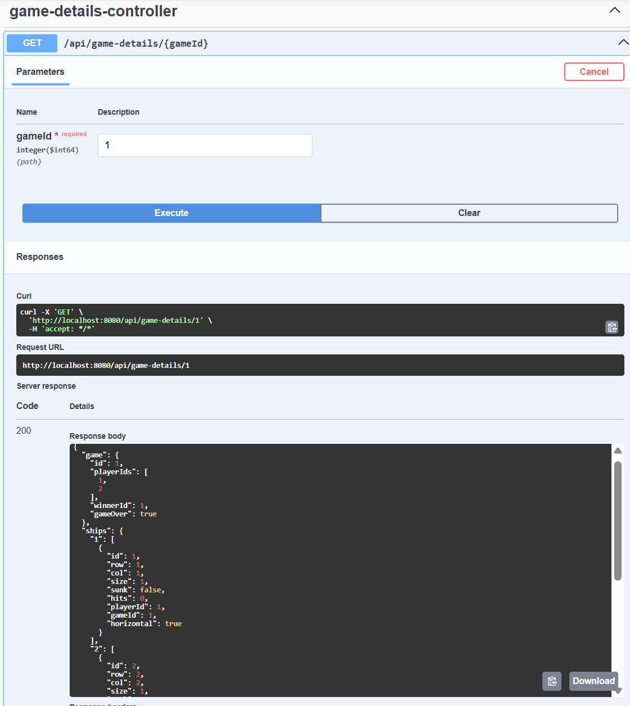

# Battleship API Gateway

This is the **API Gateway** for the Battleship Microservice Project. It acts as the single entry point for all client interactions and routes requests to the appropriate backend microservices using Spring Cloud Gateway and Eureka Service Discovery.

---

## Technologies Used

- **Spring Boot 3**
- **Spring Cloud Gateway**
- **Eureka (Netflix Service Discovery)**
- **Resilience4j (Circuit Breakers)**
- **Swagger UI (OpenAPI 3)**
- **Java 17**

---

## Gateway Features

- **Service Discovery**: Uses Eureka to discover microservices.
- **Dynamic Routing**: Routes HTTP requests to:
  - `game-service`
  - `player-service`
  - `ship-and-guess-service`
- **Circuit Breakers**: Uses Resilience4j to handle service failures gracefully with fallback routes.
- **Composition API**: Implements `/api/game-details/{gameId}` endpoint which combines:
  - Game data
  - Player data
  - Ship data
- **Swagger UI**:
  - Available at: [http://localhost:8080/webjars/swagger-ui/index.html]
---

- **Proof**:

